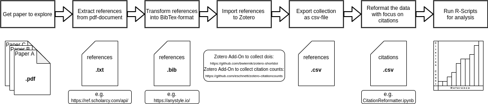

# ExploratoryPaperAnalysisR
Using R to analyse and visualise collected information regarding scientific papers for an exploratory approach to reviewing scientific papers.

# Setup
You need a way to run R scripts on your system.

## R
R is an amazing and free software for statistical analyses.
https://www.r-project.org/

## RStudio
RStudio enables an easy start into and use of R.
https://www.rstudio.com/

## Quick-Start
After downloading the scripts should work as is without any problems based on the provided data-examples.
Just replacing the contents of the files "paperDataAuthors.csv" and "paperDataReferences.csv" is all you need to personalise the analysis.

## Required information
If no information could be found, decide on a default value to not confuse the scripts.

### For "script_authors.R"
 * IdentifierGroup
 * Name
 * Publications
 * Citations
 * Hindex

### For "script_references.R"
 * Marker
 * Citations
 * PublisherName
 * Publisher
 * Maturity
 * OfficialDoi
 * OfficialDoiCount
 * Category
 * Views

